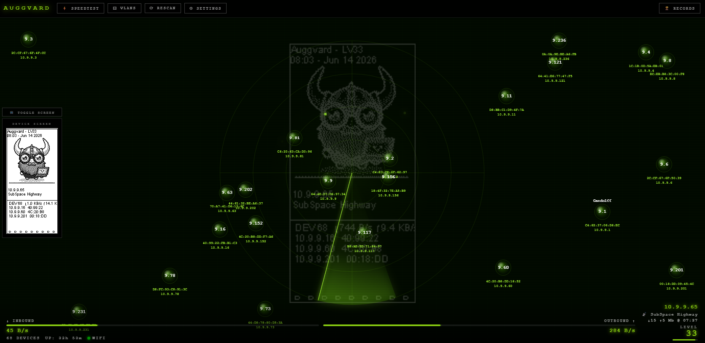
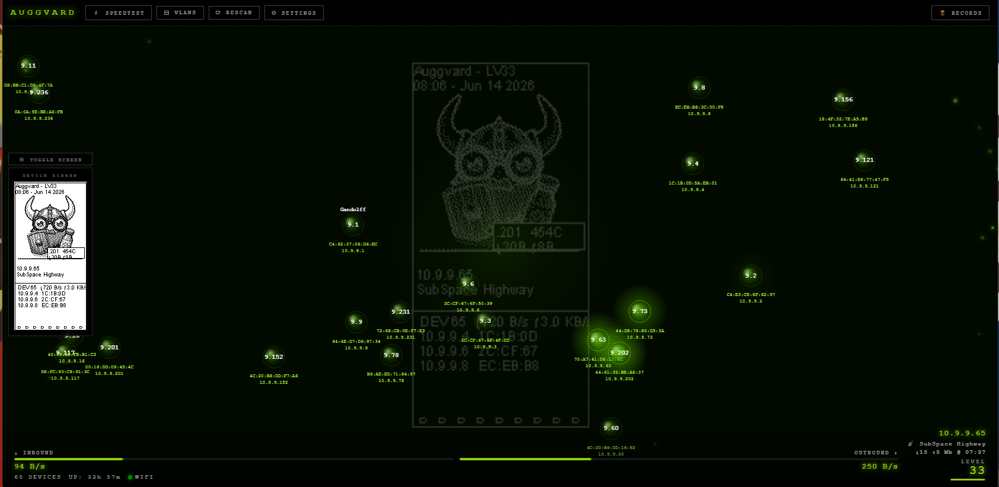
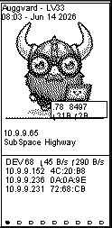
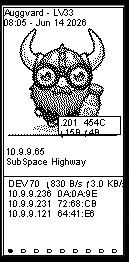
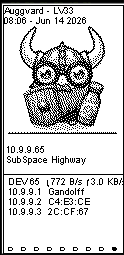

# Mild-Viking — Passive Home Network Monitor

A fun, lightweight Raspberry Pi network traffic monitor with a 2.13" e-paper display and a real-time web dashboard.

Originally forked from [Ragnar](https://github.com/PierreGode/Ragnar) (which descended from [Bjorn](https://github.com/infinition/Bjorn)). **All offensive security, scanning, and attack tooling has been completely removed.** Mild-Viking is a passive observer that lives safely on your home network.

> **Your Viking, your name.** Give your device a custom name — it shows up on the e-paper display, the web dashboard title, and all reports.

> **Built-in speed tests.** Run internet speed tests on a schedule or on demand. Download, upload, and ping results appear on the e-paper display and the live dashboard.

> **Router integration.** Connect to an **OPNsense** or **pfSense** firewall via API to pull real hostnames from your DHCP leases — so devices show up by name instead of just MAC addresses.

---

## Screenshots

### Web Dashboard

<p align="center">
  
</p>

<br>

<p align="center">
  
</p>

<br>

### E-Paper Display

<p align="center">
  
  &nbsp;&nbsp;&nbsp;&nbsp;
  
  &nbsp;&nbsp;&nbsp;&nbsp;
  
</p>

---

## Features

- **Passive traffic monitoring** — watches your network in read-only mode; no aggressive scans
- **E-paper display** — formatted for a Waveshare 2.13" HAT (250×122 px); cycles through sub-pages automatically:
  - Device list (hostname, IP, per-device data usage)
  - Network VLANs / subnets
  - Top traffic by device
  - Speed test results (↓ / ↑ / ping / last run time)
  - Uptime & system stats
- **Day / night Viking images** — cycles through themed artwork every 15 seconds; switches between day and night sets automatically
- **Gamified uptime** — gains 1 level per hour of continuous uptime
- **Hall of Records** — tracks longest uptime, most data received/sent, most devices seen, peak rates; pops up on the e-paper display periodically; accessible as a `🏆 RECORDS` dropdown in the web dashboard
- **Real-time web dashboard** — browse to `http://<pi-ip>:8000` from any device on your LAN
  - Floating device bubbles with hostname, MAC, IP, and data usage
  - Radar sweep animation (active traffic mode)
  - Live connection status, uptime, level, and speed test history
- **Speed tests** — scheduled or on-demand; results shown on dashboard and e-paper
- **Email notifications** — alert on network disconnect / reconnect
- **Monthly device report** — email summary of top 10 devices
- **Firewall integration** — pull enriched hostnames from OPNsense or pfSense via their APIs
- **Smart connectivity** — prefers Ethernet, falls back to WiFi; multiple known networks supported
- **Display preferences** — choose full or abbreviated MAC / IP format on the e-paper and dashboard

---

## Hardware

| Component | Details |
|-----------|---------|
| Raspberry Pi | 3B / 4 / Zero 2W (any model with GPIO) |
| E-paper display | Waveshare 2.13" e-Paper HAT V2/V3 (250×122 px) |
| Network | Ethernet recommended; WiFi supported |

The e-paper display is optional — the web dashboard works without it.

---

## Installation

Run the automated install script on your Raspberry Pi:

```bash
wget https://raw.githubusercontent.com/auggnation/Ragnarbutdifferent/main/install-mv.sh
chmod +x install-mv.sh
sudo ./install-mv.sh
```

The script will:
1. Install system dependencies (`python3`, `pip`, `libopenjp2`, `fonts-liberation`, etc.)
2. Clone this repository to `/opt/mild-viking`
3. Install Python dependencies from `requirements.txt`
4. Enable the SPI interface (required for e-paper)
5. Create and enable a `systemd` service (`mild-viking.service`)
6. Start the monitor automatically on boot

After installation, open `http://<your-pi-ip>:8000` in a browser.

---

## Service Management

```bash
# Check status
sudo systemctl status mild-viking

# Restart after config changes
sudo systemctl restart mild-viking

# View live logs
sudo journalctl -u mild-viking -f

# Stop the service
sudo systemctl stop mild-viking
```

---

## Viking Images

The e-paper display cycles through images stored in:

```
static/pics/day/    ← shown during 06:00–20:59
static/pics/night/  ← shown during 21:00–05:59
```

Add any `.bmp` image (sized for 250×122 px) to either folder and it will be included in the rotation automatically. Images cycle every 15 seconds.

---

## Firewall Integration (OPNsense / pfSense)

Go to **Settings → Firewall Integration** in the web dashboard to configure:

- **OPNsense**: enter your base URL, API key, and API secret (from System → Access → Users → API Keys)
- **pfSense**: enter your base URL and Bearer token (from the pfSense-API plugin)

Once configured, Mild-Viking pulls DHCP leases and ARP table entries to enrich device hostnames automatically.

---

## Configuration

All settings are managed from the web dashboard at `http://<pi-ip>:8000/settings`:

| Setting | Description |
|---------|-------------|
| Device Name | Name shown on e-paper and browser |
| Password Lock | Optional web dashboard password |
| WiFi Networks | Saved networks with fallback priority |
| Time & Clock | IANA timezone, NTP server |
| VLAN / Extra Subnets | Additional subnets to monitor |
| Speed Tests | Enable/disable, interval (minutes) |
| Monthly Device Report | Email a monthly summary |
| Email Notifications | SMTP config, disconnect/reconnect alerts |
| Display Preferences | MAC format (full / last-4), IP format (full / last octet) |
| Firewall Integration | OPNsense or pfSense API for hostname enrichment |

---

## Project Structure

```
traffic_monitor.py   — passive packet capture and device tracking
webapp.py            — Flask + SocketIO web server (port 8000)
display.py           — e-paper rendering loop
shared.py            — shared state between threads
firewall_integration.py — OPNsense / pfSense API clients
web/
  index.html         — real-time dashboard
  settings.html      — settings page
static/pics/
  day/               — daytime Viking images (.bmp)
  night/             — nighttime Viking images (.bmp)
data/
  config.json        — persisted settings
  highscores.json    — Hall of Records
```

---

## Credits

- **auggnation** — transformed into a safe, passive home network monitor
- **PierreGode/Ragnar** — intermediate fork
- **infinition/Bjorn** — original upstream ancestor
